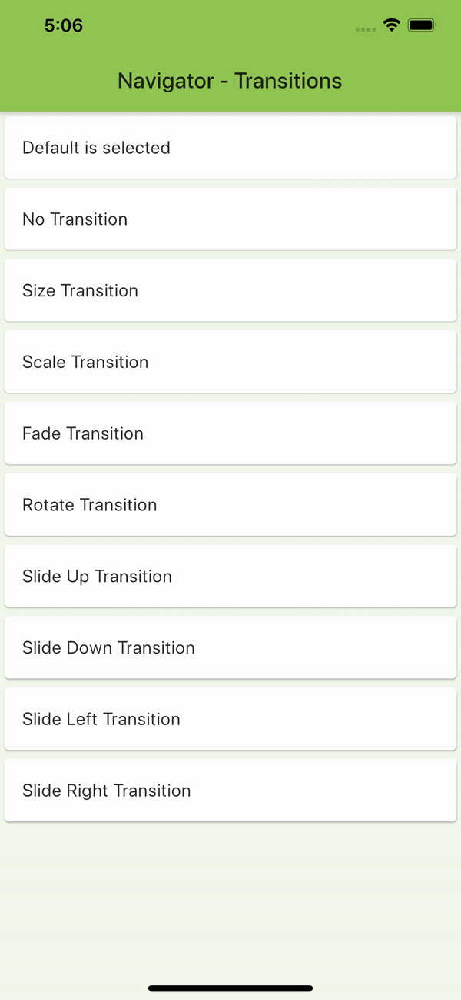

# Page Navigator PageRouteBuilder
## Video Tutorial
[YouTube Video](https://youtu.be/R11g6Seau9k)
[Blog](https://jedipixels.dev/flutter-navigator-pageroutebuilder-transitions)


## Using Navigator and PageRouteBuilder to create custom Transitions
In this project, you are going to take a look at:
- How to use the `Navigator` widget to navigate between pages with arguments (pass data)
- How to use the `Navigator Named Route` with arguments (pass data)
- How to use the `PageRouteBuilder` to create custom navigation transitions

## Navigator
The `Navigator` widget manages a stack of routes to move between pages. You can optionally pass data to the destination page and back to the original page. To start navigating between pages, you use the `Navigator.of(context).push`, ``pushNamed``, and `pop` methods.

`Navigator` is incredibly smart; it shows native navigation on iOS or Android. For example, when navigating to a new page, in iOS, the new page slides in from the right, and in Android, it slides in from the bottom.

## Navigator Sample Code
The following example shows you how to use the `Navigator.of(context).push` method to navigate to the `Details` page. The `push` method passes the `Route` arguments. To push a new `Route` argument, you create an instance of the `MaterialPageRoute` class that replaces the screen with the appropriate platform (iOS or Android) animation transition. In the example, the `fullscreenDialog` property is set to `true` to present the `Details` page as a full-screen modal dialog. By setting the `fullscreenDialog` property to `true`, the `Details` page app bar automatically includes a close button. In iOS, the modal dialog transition presents the page by sliding from the bottom of the screen toward the top, and this is also the default for Android.

```dart
Navigator.of(context).push(
  MaterialPageRoute(
    fullscreenDialog: true,
    builder: (context) => Details(),
  ),
);
```

The following example shows how to use the `Navigator.of(context).pop` method to close the page and navigate back to the previous page. You call the `Navigator.of(context).pop()` method and the page closes by sliding from the top of the screen toward the bottom.


```dart
// Close page
Navigator.of(context).pop();
```

The second example shows how to pass a value back to the previous page by passing a result value argument. The result can be a single value, object, lists (arrays) and so on.

```dart
// Close page and pass a value back to previous page
Navigator.of(context).pop('Done');
```

## Navigator Named Route
An alternate way to use `Navigator` is to refer to the page that you are navigating to by the route name. The route name starts with a slash, and then comes the route name. For example, the Details page route name is `'/details'`. The list of routes is built into the `MaterialApp()` widget. The routes have a `Map` of `String` and `WidgetBuilder` where the `String` is the route name, and the `WidgetBuilder` has a builder to build the contents of the route by the Class name (`Details`) of the page to open.

```dart
MaterialApp(
  initialRoute: '/home',
  routes: <String, WidgetBuilder>{
    '/home': (BuildContext context) => Home(),
    '/details': (BuildContext context) => Details(),
    '/about': (BuildContext context) => About(),
  },
);
```

To call the route, the `Navigator.of(context).pushNamed()` method is called by passing the route name argument.

```dart
Navigator.of(context).pushNamed('/details');
```


You also have an optional second argument to pass data

```dart
// Pass Arguments
Navigator.of(context).pushNamed(
    '/details',
    arguments: {'emotion': 'Happy'}
);
```

To Extract the arguments (data) you call the `ModalRoute.of(context).settings.arguments` and for this example you access the data by calling the arguments variable key value.

```dart
// Extract Arguments from navigated page
class _DetailsState extends State<Details> {
  Map arguments = Map();

  @override
  void didChangeDependencies() {
    super.didChangeDependencies();
    arguments = ModalRoute.of(context).settings.arguments;
  }

  @override
  Widget build(BuildContext context) {
      return Scaffold(
       body: Text(arguments['emotion']),
      );
  }
}
```

## PageRouteBuilder
The `PageRouteBuilder` class is used to create custom route transitions.
`PageRouteBuilder` provides an `Animation` object. This `Animation` can be used with `Tween` and `Curve` objects to customize the transition animation. 

You need to define a `pageBuilder` function to create the route's content and define the `transitionBuilder` function to add transition animation.

```dart
Navigator.of(context).push(
  PageRouteBuilder(
    pageBuilder: (
        BuildContext context, 
        Animation<double> animation, 
        Animation<double> secondaryAnimation) {
      return Details();
    },
    transitionsBuilder: (
        BuildContext context, 
        Animation<double> animation, 
        Animation<double> secondaryAnimation, 
        Widget child) {
      return Align(
        child: SizeTransition(
          sizeFactor: animation,
          child: child,
        ),
      );
    },
    transitionDuration: Duration(milliseconds: 500),
  ),
);
```

## How it Works

### Navigator 
The `Navigator` widget manages a stack of routes to move between pages. To start navigating between pages, you use the `Navigator.of(context).push`, `pushNamed`, and `pop` methods. You optionally passed data to the navigation page and back to the original page.

### Navigator Named Route
An alternate way to use `Navigator` is to refer to the page that you are navigating to by the route name. The route name starts with a slash, and then comes the route name. To call the route, the `Navigator.of(context).pushNamed()` method is called by passing the route name argument. You also have an optional second argument to pass data. To Extract the arguments (data) you call the `ModalRoute.of(context).settings.arguments`.

### Navigator PageRouteBuilder 
The `PageRouteBuilder` class is used to create custom route transitions.
`PageRouteBuilder` provides an ``Animation`` object. This `Animation` can be used with `Tween` and `Curve` objects to customize the transition animation.

## [License: MIT](LICENSE.md)